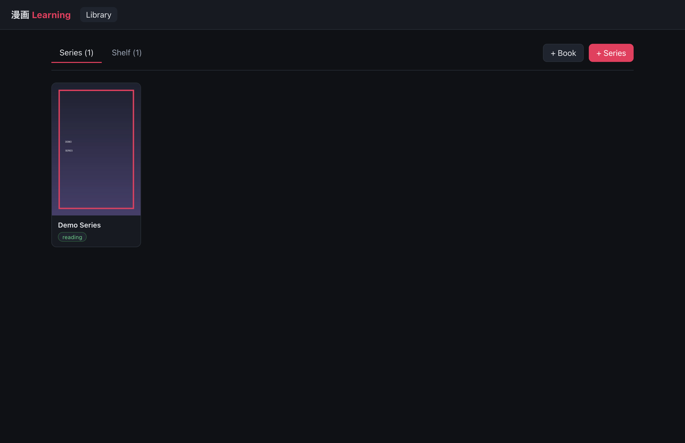
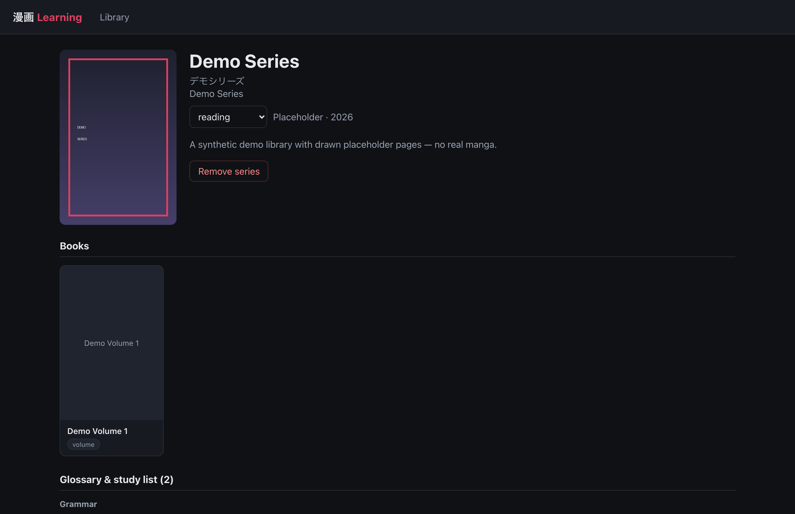
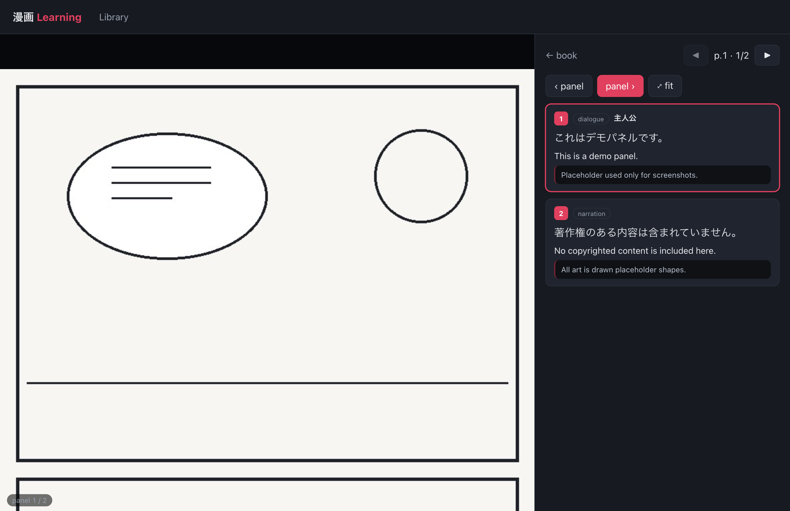

# 漫画 Manga Learning

A personal app for cataloging the Japanese manga you read and using them to study
the language. Three things it does:

1. **Identify** a manga by title (romaji or 日本語) or ISBN, with candidate matches
   to pick from (AniList + MangaDex, plus Google Books for ISBNs).
2. **Catalog** it — covers, author, year, volumes — in an organized library, with
   support for both single-series volumes (tankōbon) and **anthologies/magazines**
   like Weekly Shōnen Jump that collect many series.
3. **Read & translate** page by page. You add page images (file upload or **webcam
   capture**); Claude reads the actual images and writes panel-by-panel
   translations — original Japanese, reading, romaji, English, a literal gloss, and
   grammar/vocab notes — back into the app. A per-series **glossary** keeps names and
   vocab consistent and doubles as your study list.

**▶ Live web reader (read-only): https://ulasb.github.io/manga_learning/** — a
server-free build that opens your library straight from a local folder in the
browser (Chrome/Edge). Nothing is uploaded; see
[Read-only web reader](#read-only-web-reader-no-server--web) below.

## Screenshots

_All screenshots use synthetic demo data (`backend/seed_demo.py`) — no copyrighted manga._

| Library | Series &amp; study list | Panel-focus reader |
| --- | --- | --- |
|  |  |  |

## How translation works (the hybrid loop)

The web app stores your library, books, page images, panels, and glossary. The
*translations themselves* are produced by **Claude in Claude Code**, which reads the
page images and writes results into the same database via `backend/cli.py`. So the
loop is:

1. In the app: add a series, add a book, upload/capture its pages.
2. In Claude Code: *"translate the new pages for &lt;book&gt;."*
3. Claude runs `cli.py pending`, reads each page image, segments panels, translates
   with the series glossary as context, and writes panels back.
4. Refresh the reader — read it panel by panel. Later pages add context, so Claude
   can revise earlier panels and the glossary at any time.

No API key or per-use cost: the translation work happens in your Claude Code session.

## Data model

```
Series ── the work (One Piece). Metadata, cover, and the per-series glossary.
Book ──── a physical object: a tankōbon volume OR a magazine/anthology.
Entry ─── a section of a Book mapping a page range to one Series.
          A volume has one entry; a magazine has many.
Page ──── a physical page in a Book: the image + panel_count (the "y" in x of y).
Panel ─── one panel on a page (the "x"): JP text, reading, translation, notes…
```

Because a Page knows its Entry → Series, even a page in the middle of a Shōnen Jump
issue pulls translation context from the correct series' glossary.

## Setup

Requires Python 3.11+ (with [`uv`](https://docs.astral.sh/uv/)) and Node 18+.

```bash
# Backend
cd backend
uv sync
uv run uvicorn app.main:app --port 8000 --reload

# Frontend (in another terminal)
cd frontend
npm install
npm run dev
```

Then open **http://localhost:5173**.

> Note: open `localhost`, not `127.0.0.1` — the Vite dev server binds to `localhost`.
> Webcam capture works on `localhost` without HTTPS.

### Optional: Google Books API key

ISBN lookups use Google Books. The unauthenticated quota is small; for reliable
ISBN search set a key:

```bash
export GOOGLE_BOOKS_API_KEY=your_key   # before starting the backend
```

AniList and MangaDex need no key and cover most titles, including Japanese ones.

## Cloning on a new machine & moving your library

The code is in git; your **library data is not**. `backend/data/` — the SQLite
database, cover/page images, and the PDF drop folder — is gitignored, because it
holds personal scans of manga you own and shouldn't be uploaded anywhere.

So a fresh clone starts with an **empty library**: the database is recreated
automatically on first run, and you re-import your own content on that machine.

To carry your library (translations, glossary, page images) between your own
machines, move `backend/data/` by hand with the helper script:

```bash
# on the source machine
./scripts/data.sh backup                      # -> manga_data_backup_<timestamp>.tar.gz

# copy that archive to the other machine yourself (USB, encrypted drive, private cloud),
# then, in the repo there:
./scripts/data.sh restore manga_data_backup_<timestamp>.tar.gz
```

The archive is your private data — keep it off public storage and out of git.

## Read-only web reader (no server) — `web/`

`web/` is a **static** version of the reader that runs with no backend and can be
hosted on GitHub Pages. It reads your library **locally in the browser**: sql.js
(SQLite compiled to WebAssembly) opens your `manga.db`, and page images load from
the same folder — all client-side. **No manga content is ever uploaded**; only the
app code is published. It's read-only (browse the library and read chapters with
panel-focus zoom); adding/translating still uses the local app + `cli.py`.

- **Browser:** needs the File System Access API — use **Chrome or Edge** (desktop).
  It remembers your data folder between visits.
- **Use it:** open the Pages URL → "Choose data folder" → pick your `backend/data`
  folder (the one with `manga.db` and `images/`). Then read, fully offline.
- **Deploy:** pushing changes under `web/` runs `.github/workflows/pages.yml`, which
  builds and publishes to Pages. In the repo's **Settings → Pages**, set the source
  to **GitHub Actions** once. Served at `https://<user>.github.io/manga_learning/`.
- **Local dev:** `cd web && npm install && npm run dev`.

## The translation CLI (`backend/cli.py`)

Run from `backend/` with `uv run cli.py <command>`:

| Command | What it does |
| --- | --- |
| `pending` | List pages still needing translation (with image paths). |
| `page <id>` | Show a page: image path, series glossary, existing panels. |
| `image <id>` | Print just the absolute image path for a page. |
| `import-page <id> <file.json>` | Replace a page's panels from JSON (the fast path). Re-import to revise. |
| `set-panel <page> <idx> [opts]` | Upsert a single panel (one-off fixes). |
| `set-bboxes <id> <file.json>` | Set per-panel zoom regions (for panel-focus zoom in the reader). |
| `import-pdf <path> [opts]` | Import a PDF you own as a book (renders each page to an image). |
| `set-status <id> <status>` | Set page status. |
| `glossary <series_id>` | List a series' glossary. |
| `add-term <series_id> [opts]` | Add a glossary term. |

`import-page` JSON shape is documented in `cli.py`'s docstring.

## Project layout

```
backend/
  app/
    main.py            FastAPI app + static image serving
    models.py          SQLAlchemy ORM
    routers/           search, series, books, pages, panels, glossary
    services/          metadata (AniList/MangaDex/GoogleBooks), image storage
  cli.py               Claude's translation bridge
  data/                SQLite DB + stored images (gitignored)
frontend/
  src/
    pages/             Library, SeriesDetail, BookDetail, Reader
    components/        AddSeriesModal, AddBookModal, CameraCapture
    api.js             API client
```
